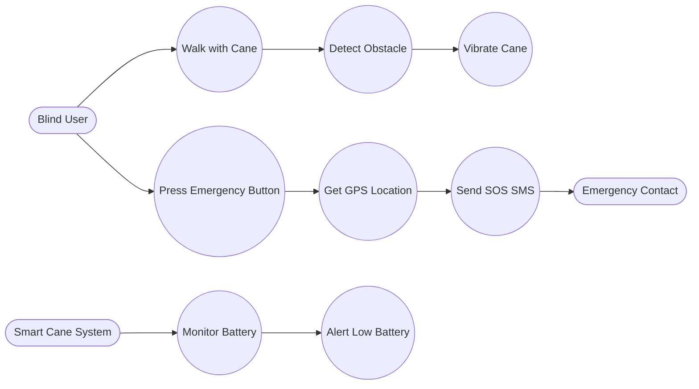

# Use Cases

This document describes the primary user interactions and system behaviors for the Smart Cane.

## Use Case Diagram

## Detailed Descriptions

### 1. Obstacle Detection & Alert
- **Actor**: User
- **Trigger**: User moves the cane near an object.
- **Flow**:
    1. The `DistanceSensor` measures the distance to the object.
    2. The `VibrationAlert` module calculates the vibration frequency.
    3. If distance < 2m, the motor vibrates. Closer distance = faster vibration.

### 2. Emergency SOS
- **Actor**: User
- **Trigger**: User presses the emergency button.
- **Flow**:
    1. The `EmergencyButton` detects the press.
    2. The system checks `GPSLocation` for valid coordinates.
    3. The `SMSCommunicator` sends an SMS to the pre-configured number with a Google Maps link.

### 3. Battery Monitoring
- **Actor**: System (Background)
- **Trigger**: Battery voltage drops below threshold.
- **Flow**:
    1. `BatteryMonitor` reads the voltage.
    2. If voltage < 3.3V, a low battery warning is triggered (e.g., specific vibration or serial log).
